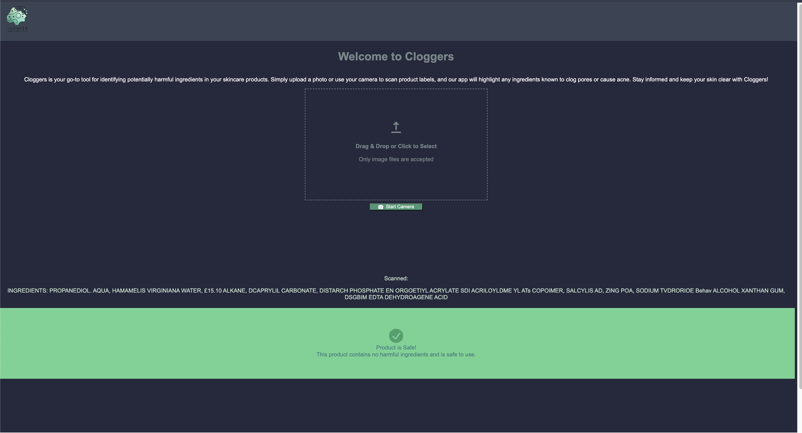

Here's a sample README for your project:

---

# Cloggers - Acne Clogger Checker

Cloggers is a web application that helps users identify potentially harmful ingredients in their skincare products. By uploading a photo or using a camera to scan product labels, the app highlights ingredients known to clog pores or cause acne. This tool empowers users to make informed decisions about the products they use on their skin.


## Features

- **Image Upload:** Upload images of product labels directly from your device.
- **Camera Capture:** Use your device's camera to scan product labels in real-time.
- **OCR Processing:** Extracts text from the uploaded or captured images using Optical Character Recognition (OCR).
- **Ingredient Analysis:** Checks extracted text against a database of harmful ingredients.
- **Safety Alerts:** Notifies users if harmful ingredients are found in the scanned text.

## Technologies Used

- **React:** A JavaScript library for building user interfaces.
- **Chakra UI:** A simple, modular, and accessible component library for React.
- **Tesseract.js:** A JavaScript OCR engine used for text recognition from images.
- **Supabase:** A backend-as-a-service platform used for database and authentication.
- **Node.js & Express:** Used for backend services and API integration.

## Getting Started

### Prerequisites

- **Node.js** (v14.x or higher)
- **npm** or **yarn**
- A **Supabase** account and project set up with a `harmful_ingredients` table.

### Installation

1. **Clone the repository:**

   ```bash
   git clone https://github.com/your-username/cloggers.git
   cd cloggers
   ```

2. **Install the dependencies:**

   Using npm:
   ```bash
   npm install
   ```

   Using yarn:
   ```bash
   yarn install
   ```

3. **Set up environment variables:**

   Create a `.env` file in the root directory and add the following variables:

   ```bash
   VITE_SUPABASE_URL=your-supabase-url
   VITE_SUPABASE_ANON_KEY=your-supabase-anon-key
   ```

4. **Run the application:**

   Using npm:
   ```bash
   npm start
   ```

   Using yarn:
   ```bash
   yarn start
   ```

   The app should now be running on `http://localhost:3000`.

## Usage

1. **Upload an Image:** Click on the "Upload" button to select an image from your device.
2. **Use the Camera:** Click on the "Start Camera" button to capture an image of a product label in real-time.
3. **View Results:** After processing, the app will display the extracted text and highlight any harmful ingredients found.

## Project Structure

- **`src/components`:** Contains the reusable React components (e.g., `FileUpload`, `CameraCapture`, `SafetyAlert`).
- **`src/hooks`:** Contains custom hooks used in the application (e.g., `useOCR`).
- **`src/utils`:** Contains utility functions, such as those for interacting with Supabase.
- **`src/styles`:** Contains styling files for the application.

## Contributing

Contributions are welcome! If you have any suggestions, bug reports, or feature requests, please feel free to submit an issue or pull request.

1. Fork the project
2. Create your feature branch (`git checkout -b feature/AmazingFeature`)
3. Commit your changes (`git commit -m 'Add some AmazingFeature'`)
4. Push to the branch (`git push origin feature/AmazingFeature`)
5. Open a pull request

## License

This project is licensed under the MIT License. See the `LICENSE` file for more information.

## Acknowledgments

- [Chakra UI](https://chakra-ui.com/) for the UI components.
- [Tesseract.js](https://tesseract.projectnaptha.com/) for the OCR capabilities.
- [Supabase](https://supabase.io/) for the backend services.

---

This README provides a comprehensive overview of your project, including how to get started, the technologies used, and how to contribute. Feel free to customize it further based on your specific project needs.